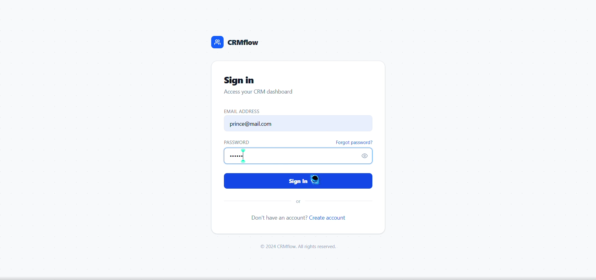
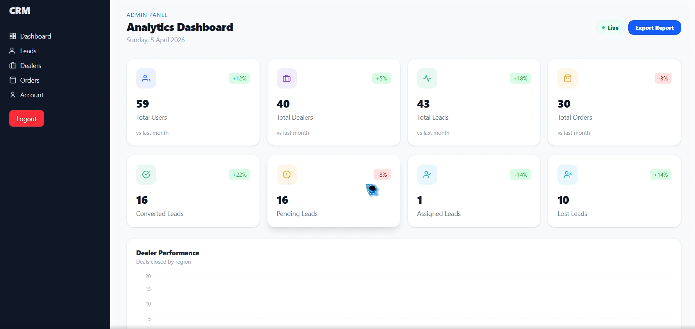

# 🚀 CRM Web Application

A full-featured Customer Relationship Management (CRM) web application built to manage leads, dealers, and orders efficiently. This project includes role-based dashboards for Admin and Dealers, real-time analytics, and a clean UI for better productivity.

--------------------------------------------------

## 📸 Screenshots

### 🔐 Signup Page

### 📊 Dashboard

Replace image paths with your actual image file paths.

--------------------------------------------------

## ✨ Features

### 👤 Authentication
- Secure login & signup system
- JWT-based authentication
- Password hashing using bcrypt
- Cookie-based session handling

--------------------------------------------------

### 🧑‍💼 Admin Features
- View all users and dealers
- Verify dealers
- Manage all leads and orders
- View analytics dashboard:
  - Total users, leads, orders
  - Converted, pending, lost leads
  - Region-wise performance
- Assign leads to dealers

--------------------------------------------------

### 🧑‍🔧 Dealer Features
- View assigned leads only
- Manage their own orders
- Update order status (pending → confirmed → delivered)
- Personalized dashboard analytics

--------------------------------------------------

### 📦 Lead Management
- Create and track leads
- Assign leads to dealers
- Filter by status (pending, assigned, converted, lost)

--------------------------------------------------

### 🛒 Order Management
- Create orders from leads
- Track order status
- Payment status handling
- Area-based analytics

--------------------------------------------------

### 📊 Dashboard & Analytics
- Real-time stats
- Region-wise performance (North, South, East, West)
- Revenue tracking
- Recent leads & orders
- Interactive charts

--------------------------------------------------

## 🛠️ Tech Stack

### Frontend
- React.js
- Tailwind CSS
- Axios
- Recharts

### Backend
- Node.js
- Express.js
- MongoDB (Mongoose)
- JWT Authentication
- bcrypt.js

--------------------------------------------------

## 📂 Project Structure

/client
  ├── components
  ├── pages
  ├── context
  ├── api

/server
  ├── controllers
  ├── models
  ├── routes
  ├── middleware

--------------------------------------------------

## 🔐 Authentication Flow

1. User logs in  
2. JWT token generated  
3. Stored in httpOnly cookie  
4. Middleware verifies token  
5. Role-based access granted  

--------------------------------------------------
## ⚙️ Installation & Setup

### 1. Clone the repository

git clone https://github.com/Prince-Saxena/CRM.git  
cd CRM

---

### 2. Install dependencies

npm install

---

### 3. Setup Environment Variables

Create a `.env` file in the server (root or backend folder depending on your setup):

MONGO_URI=your_mongodb_url  
JWT_SECRET=your_secret_key  

---

### 4. Run the application

npm run dev

👉 This will start both **frontend + backend** using concurrently.
--------------------------------------------------

## 🔥 Key Concepts Used

- Role-based access control
- Protected routes
- Context API for global state
- Optimistic UI updates
- MongoDB aggregation
- REST API design

--------------------------------------------------

## 🚀 Future Improvements

- Email notifications
- Real-time updates (WebSocket)
- Advanced filtering & pagination
- Export reports (PDF/Excel)
- Mobile responsiveness improvements

--------------------------------------------------

## 👨‍💻 Author

Prince Saxena    

--------------------------------------------------

## ⭐ Support

If you like this project:
- Star the repo  
- Fork it  
- Contribute  

--------------------------------------------------

## 🧠 One Line Summary

A modern CRM system to manage leads, dealers, and orders with real-time analytics and role-based dashboards.